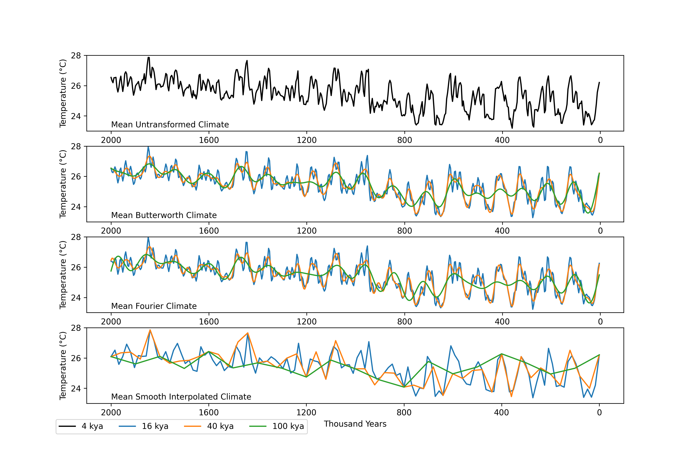

number# Python Metacommunity Models (pyMCME)

This library aims to implement the metacommunity model outlined within Thompson et al. (2020) employing the Beverton-Holt discrete time logistic growth model in an efficient, python-based, framework (Beverton and Holt 1957).

This model numerically simulates a network of habitat patches (or local communities) driven by environmental change that are connected by dispersal, with the addition of trait evolution and speciation.

A case study is presented below exploring the effect of time step (dt) on simulation behaviour.


Main Repository Functions:
- MCME_Allopatric.py: Main simulation function.
- Climate_Import.py: Functions to import and manipulate climate data.
- MCME_Functions.py: Internal functions for the simulation. You should not need to edit these.
- MCME_Properties_Functions.py: Functions to calculate alpha, gamma, and temporal gamma diversity metrics.
- MCME_Plot_Functions.py: Functions to plot simulation results.
- MCME_Demo.py: Demonstration file for simulation.

Note:
* Although pyMCME produces a phylogeny at the end of each simulation. The current format is unusable for most, if not all, tree plotting softwares. A major rewrite is required.
* If running pyMCME on a cluster it may be advisable to remove the dynamic progress bar from the main function.
* If running pyMCME from an ide like Spyder there may be a runtime penalty from VSCode. If you profile the simulation you will likely observe a large percentage of processing time attributed to threading (issue with VSCode). Running pyMCME from the terminal or a bash script is the best way to improve simulation runtime performance.
* Simulation runs on Numpy 2.0.0

## Model Framework

At the core of this general simulation model is an array of spatially explicit habitat patches with a dynamic environment that can change over a pre-defined temporal extent and resolution. As such, the user must provide information regarding the number of patches, their spatial orientation, and changes in environment. This model was built to handle HadCM3 climate data imported as a raster stack. However, data can be imported from a NetCDF4 file, but assurances need to be made that the spatial resolution matches that of a standard terrestrial HadCM3 simulation (3.75 by 2.5).   

The model, which will be referred to as pyMCME, operates through four major processes: 1) species interactions; 2) environmental (abiotic) effects; 3) dispersal processes; and 4) speciation and evolution.

### Population Dynamics

#### Species Interactions

Species interactions are determined according the the Beverton-Holt equation (Beverton and Holt 1957). Species interaction strengths are assigned using the MCME_Functions.initalize_aij function whereby the interaction category needs to be defined (stabilizing, equal, mixed, neutral) as well as the numerical range for the interaction strengths for the stabilizing and mixed interaction categories. For the mixed category, a percentage of competitively superior species needs to be provided, which is ignored in all of the other categories. During speciation events, new species interaction coefficients are redrawn from the range provided within the initialization stage. Furthermore, interaction strengths are multiplied by 0.05 to increase interaction rates.

```math
N_{ix}(t+1) = \frac{1}{1 + \sum{a_{ix}N_{jx}(t)}}
```

<p align="center">
  
</p>

#### Environmental (abiotic) Effects

Growth rate within pyMCME is determined by the match between a species niche optimum and the current environmental conditions. Currently, a Gaussian function is used to determine the relationship between the environment and growth. For this function a maximum growth rate needs to be defined, which is defaulted to 5 to speed up processes within the model. Additionally, a sigma value needs to be provided which describes the niche breadth for a species (see figure 2).

```math
r_{ix}(t) = r_{max}e^{-(\frac{z_{i} - env_{x}(t)}{2\sigma_{i}})^2}
```

<p align="center">
  
</p>

#### Demographic Stochasticity

Following Thompson et al. (2020), demographic stochasticity is introduced within the model via a random population integer value drawn from a Poisson distribution prior to dispersal by the following equation:

```math
N_{ix}(t+1) = Poisson(max{\frac{1}{1 + \sum{a_{ix}N_{jx}(t)}}, 0})
```

### Dispersal

After each time-step individuals from within a habitat patch can disperse across the landscape based upon their density within each patch and a pre-defined dispersal rate. Dispersal distance follows a Poisson distribution according to the below equation. A probability of dispersal is then assigned based upon the density of species within a patch.

```math
I_{ix}(t) = \frac{\sum{E_{iy}(t)^{-L_{i}d_{x}}}}{\sum{E_{ix}(t)}}
```

The full equation that determines population abundance within each patch is as follows, with the a Poisson value drawn from the right side of the equation, excluding immigration and emigration.

```math
N_{ix}(t+1) = r_{ix}N_{ix}(t)\frac{1}{1 + \sum{a_{ix}N_{jx}(t)}}-E_{ix}(t) + I_{ix}(t)

```

<p align="center">
  
</p>

### Trait Evolution and Speciation

Trait evolution within pyMCME is very simple whereby a trait will evolve via random drift based upon a defined standard deviation for a random value drawn from a uniform distribution. The default standard deviation for trait evolution is 0.05.

** Trait Evolution **
```math
z_{ix}(t+1) = z_{ix}(t) + U(0.05)
```

The most complicated aspect of this model, and the area by which it varies the most from other models, is via speciation. To be clear, pyMCME does not adhere to strict allopatic speciation based upon patch isolation from the main species pool. Instead, speciation occurs when a local communities (single population within a patch) mean niche optimum extends beyond the standard deviation of the entire species (whole metacommunity excluding the patch of interest) plus some threshold value for speciation. This formulation of speciation allows for gene flow to occur due to dispersal processes, but also allows for speciation to occur via random drift. Patch isolation alone does not guarantee speciation.

```math
\mu_{ix}^{M} > \sigma_{ix} + \omega_{x}
```

<p align="center">
  
</p>

### Future Work

1. Include tradeoffs along multiple trait axes, including a trait axes related to dispersal ability.
2. Convert the Gaussian function to a Gompertz Gaussian function. I also aim to incorporate the metabolic theory of ecology (Brown et al.).
3. Move beyond a stochastic dispersal process and instead link dispersal probability to the environment as well as to the strength of species interactions. This may be an ideal process to include as a tradeoff.    
4. Alter the rate of trait evolution as a tradeoff with dispersal ability or species interactions.
5. Include increased speciation rates that are tied to environmental conditions. Increased speciation due to warming temperatures.

## Simulation Initialization

Simulations are initialized at the beginning of each experiment based upon a starting number of patches and species. Currently, habitat patches are derived from the HadCM3 climate model simulations, with graph distances calculated based on each grid cells latitude and longitude positions. Habitat patches are drawn randomly from a total map extent. A user can define the desired patch coordinates for the HadCM3 climate inputs.

* Future work will aim to accommodate the CHELSA-Trace21K climate ensemble data.

Users must define:
- Number of starting species (S)
- Maximum growth rate
- Number of patches (M)
- Geographic positions of patches
- Climate input
- Dispersal rate
- Niche breadth
- Matrix of niche optimums for start of simulation
- Speciation threshold
- Species interaction type
- Alpha matrix
- Simulation time (derived from seed time, burn in time, and total steps provided within the climate input)

Simulation output:
- MxS matrix of patch occupancy
- MxS matrix of niche optimums for species per patch
- MxS matrix of species interaction coefficients
- Phylogeny (anscestor/descendent)
- Divergence time corresponding to speciation occurrences
- Species origination times in patches

### Example Dynamics

Simulation of South America initially seeded with 25 founder species under stabilizing interactions. Simulation was run for 100 seeding steps, 100 burnin steps, and 500 model steps using the HadCM3BB_Long climate reconstructions from 2-million-years-ago to present (Farnsworth and Valdes 2022). Dispersal distance was 0.1 per step, speciation threshold of 0.25, ,max growth rate of 5, and niche breadth $\sigma = 0.5$.

<p align="center">
  
</p>

Video illustrating spatial dynamics for a single species throughout the full extent of the model. The species goes extinct in the final time step, prior to the completion of the simulation run. Note that the brighter the color (yellow) within the video the larger the population.

<p align="center">
  
</p>

## Effect of Step Size on Simulation Dynamics

A major objective within macroecology has been to uncover global patterns of species diversity. However, under the looming impact of anthropogenic climate change, secondary objectives such as identifying at-risk biodiversity hotspots worthy of increased conservation efforts have emerged. Over the past decade, and to facilitate these broader objectives, concerted shifts have been made to move beyond the identification of statistical patterns describing species diversity to the identification of the fundamental processes that drive these patterns (Gotelli et al. 2009). Process-based mechanistic models (general simulation models) have become a popular tool and have had a large degree of success in exploring mechanisms driving species diversity both regionally and globally (Rangel et al. 2018; Saupe et al. 2020). Recent work by Hagen et al. (2021) has been to develop accessible tools that can enable researchers to further utilize a process-based modelling framework, highlighting the utility and burgeoning popularity of these methods.

A key aspect and strength within eco-evolutionary simulations (general simulation models) is the ability for system dynamics to unfold within a spatially explicit domain, forced by paleoclimate reconstructions encompassing a period from Earth's history. As an example, the simulation results derived from general circulation models like the Hadley Centre Coupled Model, version 3 (HadCM3) or PLASIM intermediate-complexity atmospheric general circulation model, are used to drive processes within the eco-evolutionary simulations spanning from the present-day to hundreds-of-thousands to millions-of-years into the past (e.g., Saupe et al. 2020; Rangel et al. 2018). Although it may be obvious that the total time contained within paleoclimate reconstructions will affect simulation dynamics, for example, the exclusion of Earth history older than the Mid-Pleistocene Transition (~1.2 million years ago) which saw drastic changes in the frequency and strength of orbital forcings from 100-thousand-year (kya) cycles to 41-kya cycles, little attention has been paid on the role of step size (dt) on the dynamics within these models. The objective of this section is thus to explore how changes in step size will alter simulation dynamics.

To explore the role of dt on model dynamics an example is presented below using the pyMCME model run under different scenarios of climate resolution (i.e., dt). Simulations were run under identical parameter values for a stabilizing and equal interactions scenario, as well as a broad and narrow niche breadth scenario.

Simulation dt was altered via three methods: 1) an interpolation smoothing technique; 2) a lowpass Butterworth filter; and 3) alteration to the time series Fourier coefficients, for paleoclimate reconstructions derived from Farnsworth and Valdes (2020). The below figure illustrates the effects of time series smoothing under each method within the time domain, followed by another figure in the frequency domain. The important conclusion from each of these figures is that the alteration of dt within the paleoclimate time series alters both the occurrence of periodic and quasi-periodic forcings, but also the time series temporal autocorrelation (slope in the frequency domain). It needs to be noted that to ensure model parameterization was held constant between all simulation runs, the number of observations contained within the time series had to be held constant (constant n-observations). Thus alterations in dt are effectively a low-pass filter that excludes high-frequency signal.

<p align="center">
  
</p>

<p align="center">
  
</p>

The below two videos illustrate the role of climate variance on population dynamics for a randomly chosen grid cell from within the simulation.

### Wide Niche High Variance Climate Forcing under Stabilizing Interactions (16 kya steps)

<p align="center">
  
</p>

### Wide Niche Low Variance Climate Forcing under Stabilizing Interactions (100 kya steps)

<p align="center">
  
</p>

### Narrow Niche High Variance Climate Forcing under Stabilizing Interactions (4 kya steps; Original Resolution Climate Time Series)

<p align="center">
  
</p>

### Narrow Niche Low Variance Climate Forcing under Stabilizing Interactions (100 kya steps)

<p align="center">
  
</p>


### Comparison of Model Dynamics

Depending upon the selected niche breadth the effects of time step selection will have different results.

#### Broad Niche Breadth

For a broad niche ($\sigma >= 2$) alpha and gamma diversity appear almost indistinguishable under stabilizing and equal interactions with variable time steps. However, as illustrated within the second figure, species evenness increases under lower variance.

<p align="center">
  
</p>

<p align="center">
  
</p>

#### Narrow Niche Breadth

The effects of time step choice has much more pronounced impacts under narrow niche values with higher rates of speciation (reduced speciation threshold). This figure illustrates the large discrepancy between alpha and gamma diversity between simulations under the 4 kya variance structure versus the 100 kya structure. Species evenness is also increased under the lower variance scenario as above.

<p align="center">
  
</p>

### Discussion

#### Diversity Dynamics Under Alternative Step Size

Hill numbers represent a simple framework to assess abundance weighted community diversity, parameterized by q-orders, that give varying degrees of weight to rare versus common species depending on the value of q (Hill 1973; Chao et al. 2014). For q = 0, all abundance weighted community diversity values will equal 1, with the N^{0} Hill number giving no preference to rare versus common taxa. This also yields a maximum Hill number for a community for all other chosen values of q. On the opposite end of the spectrum for q = 2 (or q &#8594 &#8734) a minimum Hill number will be produced that gives larger weight on common versus rare species. For a community that has an equal number of species at the same abundance, N^{0} = N^{2}, and for communities with a single dominant species N^{0} >> N^{2}.

As a way to compare evenness between communities, a normalized vector can be defined between the maximum and minimum Hill numbers within a single community. If a community is perfectly even, the vertical component of the vector will be 0, while if the community is perfectly uneven, the vertical component of the vector will approach 1 (similar to Chao and Ricotta 2019).

As a means to compare species evenness between the different simulations, the normalized vector comparing N^{0} - N^{2} was calculated for each time step in the simulations for each individual plot (P = 165). The relative number of patches with greater evenness were then compared between the simulations for each time step and plotted as a line plot (Normalized Proportion of $D^{0} - D^{2}$ between High - Low Variance). For any time step with a value > 0.5, the high-variance simulation had a higher proportion of uneven patches as compared to the low variance simulation.  

a > b; a is more uneven

```math
{q}^D = \sum{(p_{i}^{q})^{1/(q-1)}}}; q > 0, q != 1
```

```math
{1}^D = lim {q}^D = exp{-\sum{p_{i}logp_{i}}}
```

<p align="center">
  
</p>

<p align="center">
  
</p>

<p align="center">
  
</p>

<p align="center">
  
</p>


#### From Ordinary Differential Equations to Cellular Automata

#### Step Size as a Parameter

Based upon work by Vasseur and Yodiz (2004) and Cuddinghton and Yodiz (1999), changes within the structure of temporal autocorrelation can have impacts on population dynamics, mainly synchrony and persistence. As such, a better method is to alter the Fourier-coefficients for the high-frequency domains you want to exclude. Methodologically, this involves converting the time series into the frequency domain and setting the amplitudes of the Fourier-coefficients above a certain frequency threshold to zero. This ensures that the power and autocorrelation of periodic phase-coherent and quasi-periodic phase-incoherent processes are maintained in the low-frequency domains.

### Conclusions

Time step choice can have dramatic effects on simulation dynamics and community properties under different parameter combinations. Just as with any parameter chosen within these models, time step needs to be carefully considered as it can dramatically change community properties throughout the duration of the simulation, species evenness, and geographic locations of speciation and extinction events.

## References

1. Gotelli et al. 2009
2. Rangel et al. 2018
3. Saupe et al. 2020
4. Hagen et al. 2021
5. Davis, TQ., Bongard, J. 2022. Step Size is a consequential parameter in continuous cellular automata [Preprint]. arXiv:2205.12728v1.
6. Thompson, PL., Guzman, LM., De Meester, L., Horváth, Z., Ptacnik, R., Vanschoenwinkle, B., Viana, DS., Chase, JM. 2020. A process-based metacommunity framework linking local and regional scale community ecology. Ecology Letter 23: 1314-1329. DOI: 10.1111/ele.13568.
7. Beverton, RJH., Holt, SJ. 1957. On  the dynamics of exploited fish populations. Ministry of Agriculture, Fisheries and Food.
