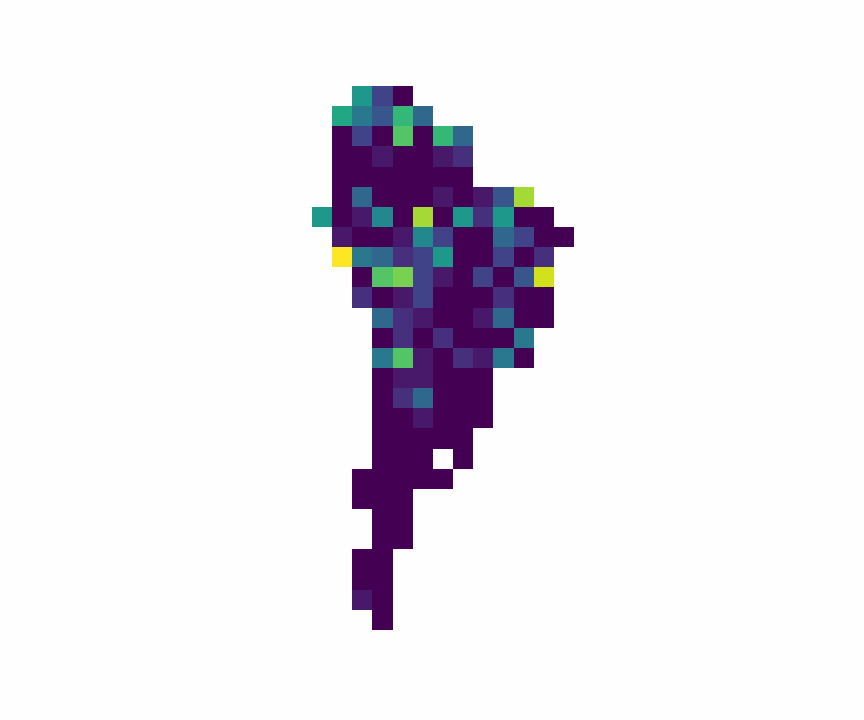
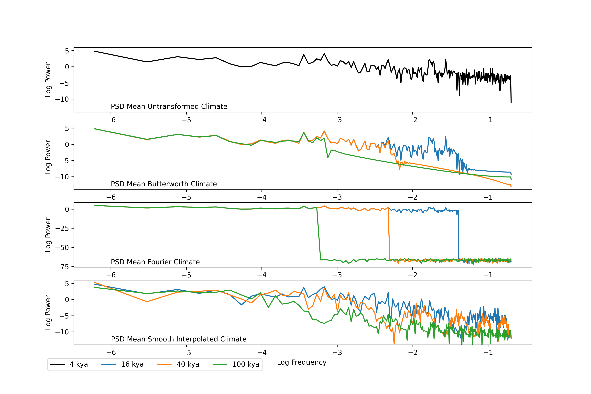

# Python Metacommunity Models (pyMCME)

This library aims to implement the metacommunity model outlined within Leibhold and Chase (2018) in an efficient, python-based, framework to later study community dynamics using the Haar flucutation wavelet outlined by Lovejoy (2015).

This model numerically simulates a network of habitat patches (or local communities) that are connected by dispersal. The metacommunity framework includes all of the normal archetypes as described by Leibhold and Chase (2018), with the addition of trait evolution and speciation.  


Note:
* Although pyMCME produces a phylogeny at the end of each simulation. The current format is unusable for most, if not all, tree plotting softwares. A major rewrite is required.
* If running pyMCME on a cluster it may be advisable to remove the dynamic progress bar from the main function.
* If running pyMCME from an ide like Spyder there may be a runtime penalty from VSCode. If you profile the simulation you will likely observe a large percentage of processing time attributed to threading (issue with VSCode). Running pyMCME from the terminal or a bash script is the best way to improve simulation runtime performance.
* Simulation runs on Numpy 2.0.0

## Model Framework

At the core of this general simulation model is an array of spatially explicit habitat patches with a dynamic environment that can change over a pre-defined temporal extent and resolution. As such, the user must provide information regarding the number of patches, their spatial orientation, and changes in it's climatic conditions. This model was built to handle HadCM3 climate data imported as a raster stack. However, data can be imported from a NetCDF4 file, but assurances need to be made that the spatial resolution matches that of a standard terrestrial HadCM3 simulation (3.75 by 2.5).   

The model, which will be referred to as pyMCME, operates through four major processes: 1) species interactions; 2) environmental (abiotic) effects; 3) dispersal processes; and 4) speciation and evolution.

### Population Dynamics

#### Species Interactions

Species interactions are determined according the the Beaverton-Holt equation as described in Thompson et al. (2020). Species interaction strengths are assigned using the MCME_Functions.initalize_aij function whereby the interaction category needs to be defined (stabalizing, equal, mixed, neutral) as well as the numerical range of the interactions for the stabalizing and mixed interaction categories. For the mixed category, a percentage of competitively superior species needs to be provided, which is ignored in all of the other catagories. During speciation events, new species interaction coefficients are redrawn from the range provided within the initialization stage. Furthermore, interaction strengths are multiplied by 0.05 to increase interaction rates.

```math
N_{ix}(t+1) = \frac{1}{1 + \sum{a_{ix}N_{jx}(t)}}
```

Future work will be to include in tradeoffs along multiple trait axes, including a trait axes related to dispersal ability.

<p align="center">
  
</p>

#### Environmental (abiotic) Effects

Growth rate within pyMCME is determined by the match between a species niche optimum and the current environmental conditions. Currently, a Gaussian function is used to determine the relationship between the environment and growth. For this function a maximum growth rate needs to be selected, which is defaulted to 5 to speed up processes within the model. Additionally, a sigma value needs to be provided which describes the niche breadth for a species (see figure 2).

```math
r_{ix}(t) = r_{max}e^{-(\frac{z_{i} - env_{x}(t)}{2\sigma_{i}})^2}
```

Future work will be to convert the Gaussian function to a Gompertz Gaussian function. I also aim to incorporate the metabolic theory of ecology (Brown et al.) into the model, and an effect of temperature on dispersal.

<p align="center">
  
</p>

#### Demographic Stochasticity

Following Thompson et al. (2020), demographic stochasticity is introduced into the model via a random population integer value drawn from a Poisson distribution prior to dispersal process by the following equation:

```math
N_{ix}(t+1) = Poisson(max{\frac{1}{1 + \sum{a_{ix}N_{jx}(t)}}, 0})
```

### Dispersal

After each time-step individuals from within a habitat patch can disperse across the landscape based upon their density within each patch and a pre-defined dispersal rate. Dispersal distance follows a Poisson distribution according to the below equation. A probability of dispersal is then assigned based upon the density of species within a patch.

```math
I_{ix}(t) = \frac{\sum{E_{iy}(t)^{-L_{i}d_{x}}}}{\sum{E_{ix}(t)}}
```

The full equation that determines population abundance within each patch is as follows, with the a Poisson value drawn from the right side of the equation, excluding immigration and emigration.

```math
N_{ix}(t+1) = r_{ix}N_{ix}(t)\frac{1}{1 + \sum{a_{ix}N_{jx}(t)}}-E_{ix}(t) + I_{ix}(t)

```

<p align="center">
  
</p>

Future work will look to move beyond a stochastic dispersal process and instead link dispersal probability to the environment as well as to the strength of species interactions. This may be an ideal process to include as a tradeoff.    

### Trait Evolution and Speciation

Trait evolution within pyMCME is very simple whereby a trait will evolve via random drift based upon a defined standard deviation for a random value drawn from a uniform distribution. The default standard deviation for trait evolution is 0.05.

** Trait Evolution **
```math
z_{ix}(t+1) = z_{ix}(t) + U(0.05)
```

Future work could look to alter the rate of trait evolution as a tradeoff with dispersal ability or species interactions.

The most complicated aspect of this model, and the area by which it varies the most from other models, is via speciation. To be clear, pyMCME does not adhere to strict allopatic speciation based upon patch isolation from the main species pool. Instead, speciation occurs when a local communities (single population within a patch) mean niche optimum extends beyond the standard deviation of the entire species (whole metacommunity excluding the patch of interest) plus some threshold value for speciation. This formulation of speciation allows for gene flow to occur due to dispersal processes, but also allows for speciation to occur via random drift.

```math
\mu_{ix}^{M} > \sigma_{ix} + \omega_{x}
```

<p align="center">
  
</p>

Future work will aim to include increased speciation rates that are tied to environmental conditions. Increased speciation due to warming temperatures.

## Simulation Initialization

Simulations are initialized at the beginning of each experiment based upon a starting number of patches and species. Currently, habitat patches are derived from the HadCM3 climate model simulations, with graph distances calculated based on each gridcells latitude and longitude positions. Habitat patches are drawn randomly from a total map extent. A user can define the desired patch coordinates for the HadCM3 climate inputs.

* Future work will aim to accommodate the CHELSA-Trace21K climate ensemble data.

Users must define:
- Number of starting species
- Maximum growth rate
- Number of patches
- Geographic positions of patches
- Climate input
- Dispersal rate
- Niche breadth
- Matrix of niche optimums for start of simulation
- Speciation threshold
- Species interaction type
- Alpha matrix
- Simulation time (derived from seed time, burn in time, and total steps provided within the climate input)

Simulation output:
- MxS matrix of patch occupancy
- MxS matrix of niche optimums for species per patch
- MxS matrix of species interaction coefficients
- Phylogeny (anscestor/descendent)
- Divergence time corresponding to speciation occurrences
- Species origination times in patches

### Example Dynamics

Simulation of South America initially seeded with 25 founder species under stabilizing interactions. Simulation was run for 100 seeding steps, 100 burnin steps, and 500 model steps using the HadCM3BB_Long climate reconstructions from 2-million-years-ago to present (Farnsworth and Valdes 2022). Dispersal distance was 0.1 per step, speciation threshold of 0.25, ,max growth rate of 5, and niche breadth $\sigma = 0.5$.

<p align="center">
  
</p>

Video illustrating spatial dynamics for a single species throughout the full extent of the model. The species goes extinct in the final time step, prior to the completion of the simulation run. Note that the brighter the color (yellow) within the video, the larger the population.

<p align="center">
  
</p>

## Simulation Example: Effect of Climate Model Time Step on Simulation Dynamics

One persistent question that exists within the scope of eco-evolutionary or general simulation models to study macroecological processes is the effect of simulation time step (the duration of time represented by each model step) on the internal dynamics of the simulation and the final community properties (alpha and gamma diversity, evenness, etc). To explore the effects of time step on the model dynamics an example is presented below using the pyMCME model, run under different scenarios of climate resolution (the amount of variance integrated per time step is another way to think about this problem). Simulations were run under identical parameter values for a stabilizing and equal interactions scenario, as well as a broad and narrow niche breadth scenario.

The most important aspect of this experiment is deciding exactly how the climate time step will be altered within the environmental data (HadCM3BB_Long from Farnsworth and Valdes). Two methods were explored, interpolation and Fourier-coefficent alteration, with strong recommendations being given for the later for future use in similar experiments. The below figure illustrates the effects of time series smoothing under each method within the time domain. The proceeding figure illustrates the same time series within the frequency domain, illustrating some problems with the interpolation method.

The idea behind the climate smoothing methods is to exclude high-frequency variation, that would be exclude when large time steps are taken between climate inputs within a simulation run. For example, if the native-resolution of the climate is a temperature observation every 4-thousand-years, what would that climate time-series look like if the observations were every 16-thousand-years instead? One key caveat is that since we do not want to scale the parameter values for the other processes within the model, we need the number of climate observations to remain constant. The most intuitive way to achieve this goal is through skipping every a set number of points between real observations and interpolating equally spaced points between the values to hold n-observations equal. For example, we have initial observations at 0 kya, 4 kya, 8 kya, and 12 kya. If we want to increase our time step from 4 kya to 12 kya, we would exclude the observation at 4 and 4 kya, and instead context the 0 - 12 kya observations with a linear model and interpolate new values at 4 and 8 kya. This effectively excludes high-frequency variation. The problem with this method is that you also alter the temporal autocorrelation of your climate observations by employing an interpolation based method. This is demonstrated in the frequency-domain figure by the shifted slope in the log-log plot of climate power versus frequency. Based upon work by Vasseur and others (2009) and Cuddingham and Yodiz (1999), changes within the structure of temporal autocorrelation can have impacts on population dynamics, mainly synchrony and persistence. As such, a better method is to alter the Fourier-coefficients for high-frequency processes you want to exclude. Methodologically, this involves converting the time series into the frequency domain and setting the amplitudes for Fourier-coefficients above a certain frequency threshold to zero. This ensures that the power and autocorrelation of periodic phase-coherent and quasi-periodic phase-incoherent processes are maintained in the low-frequency domains.

* Need to upload draft quality figures for the time and frequency domain plots of the environmental data.

<p align="center">
  
</p>

<p align="center">
  
</p>

The below two videos illustrate the role of climate variance on population dynamics for a randomly chosen grid cell from within the simulation.

### High Variance Climate Forcing (4 kya steps)

<p align="center">
  
</p>

### Low Variance Climate Forcing (100 kya steps)

<p align="center">
  
</p>

### Comparison of Model Dynamics

#### Broad Niche Breadth

#### Narrow Niche Breadth
